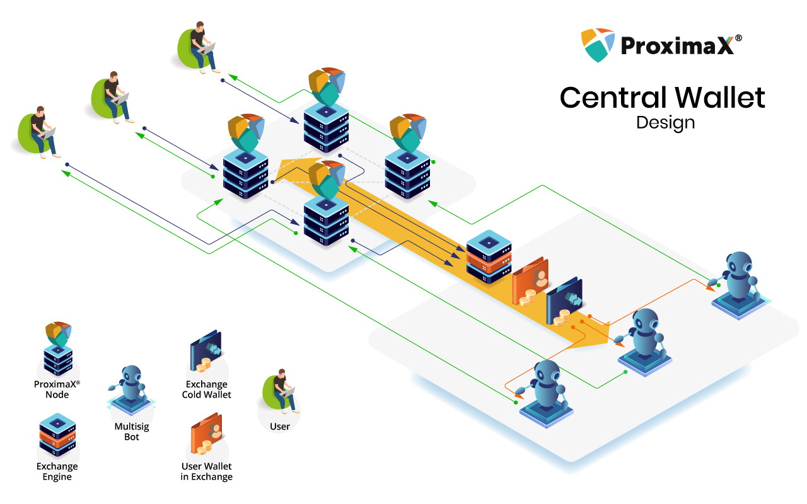
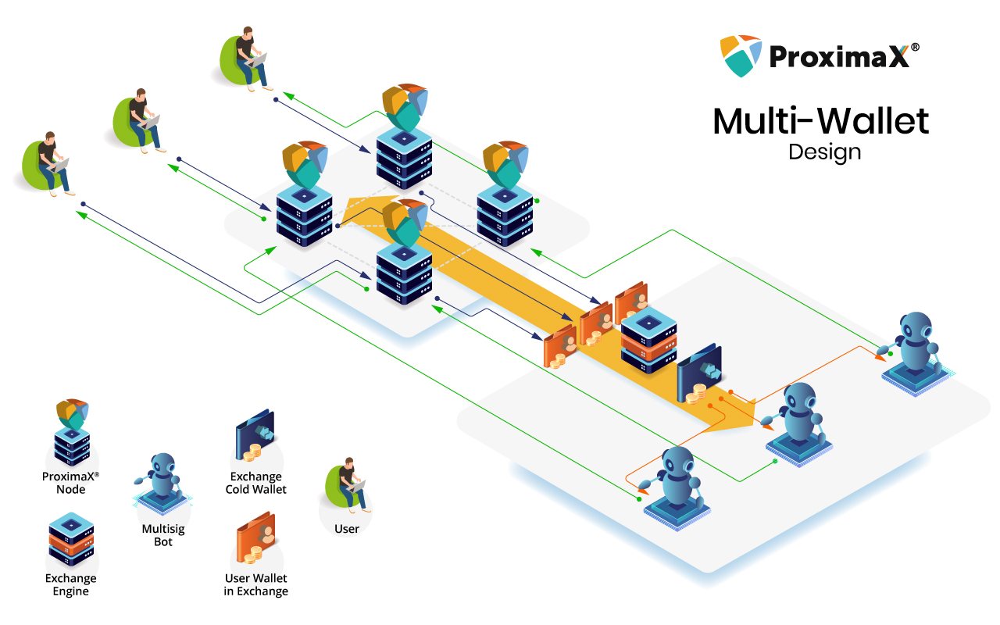
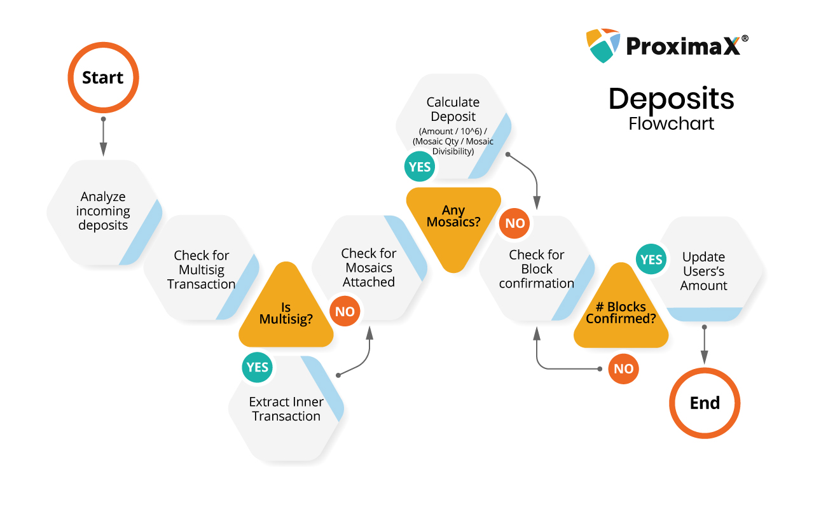

## XPX Exchange Integration

This document serves as a guide for exchanges to list XPX and other tokens (Mosaics) created on the ProximaX Sirius platform. The exchange integration designs in this document are those commonly used by exchanges. We nonetheless invite public contributors to improve this document where needed.  

Following respective listing agreements, exchanges must not use exchange funds to set up nodes on the ProximaX Sirius platform to validate transactions and earn fees.

### Central Wallet Design

- All deposits and withdrawals occur via a central wallet.

- Using the Sirius Chain message feature, users are identified by their unique identifier (“UID”) on an exchange’s database. The UID is only shown in the user’s dashboard during the deposit confirmation.

- Exchanges should use a central wallet. It is highly recommended to set up the wallet with Sirius Chains’s multisig feature to protect users’ funds from internal compromises and external hacks. Also, it is advised to have a cold wallet to hold a certain threshold for the pool of XPXs.

- With the multisig feature in Sirius Chain, withdrawals can be automated using bots communicating with different nodes to ensure proper security combined with users’ 2FA.

- This design is shown below:
  - Black lines represent the deposits.
  - Green lines represent the withdrawals.
  - Red lines represent co-signing bots.

### Multi-wallet Design

- All user accounts on the exchange have their own independent Sirius Chain address.

- The Sirius Chain address private keys are managed by the exchange through its own security measures.

- Deposits all happen directly with the Sirius Chain address of the user’s wallet. However, the funds are transferred automatically to a central wallet which is used for withdrawals. This central wallet should follow the below design to ensure proper security, i.e., using a cold wallet and the multisig feature.

- The exchange will need to use strong security measures to protect the private keys from being compromised.

- This design is shown below:
  - Black lines represent the deposits.
  - Green lines represent the withdrawals.
  - Red lines represent co-signing bots.

### Deposits

On listening to incoming deposits, it is important to note the various transaction types to ensure proper update of the user’s dashboard.  It is advisable to always wait for about three block confirmations before crediting the values to the user’s dashboard. The flow to handle the various transactions and determining the exact amount of XPXs deposited is shown below. This flow also ensures that an exchange’s system will support the listing of any tokens created on Sirius Chain. However, the actual listing of a token (Mosaic) will depend on the exchange and the token owner.

### Example of Transactions

Check out the list of transactions
[Examples](example.md)
